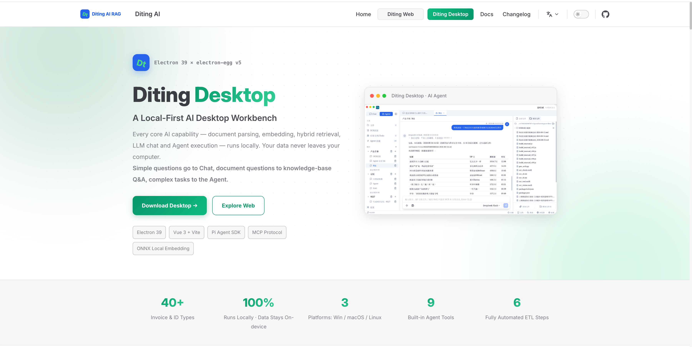

# Diting AI Desktop

<p align="center">
  <a href="https://ditingrag.com/cn/products/desktop">🌐 Website</a> ·
  <a href="#download">📥 Download</a> ·
  <a href="#quick-start">🚀 Quick Start</a> ·
  <a href="./README.md">中文</a> ·
  <a href="./README.ja.md">日本語</a> ·
  <a href="./README.ko.md">한국어</a>
</p>

> For detailed product introduction, please visit the official website: **[https://ditingrag.com/cn/products/desktop](https://ditingrag.com/cn/products/desktop)**

---

<div align="center">

## ⭐ If Diting helps you, please give it a Star! Recommend it to your friends and colleagues — that's our biggest motivation ⭐

</div>

---

Diting AI Desktop is an enterprise-grade cross-platform desktop AI assistant built on the [electron-egg v5](https://github.com/dromara/electron-egg) framework.

It integrates local file management, RAG knowledge base retrieval, Pi Agent intelligent agents, LLM multi-turn conversations, OCR receipt recognition, and other AI capabilities for Windows / macOS / Linux.

> This project is inspired by [Proma](https://github.com/ErlichLiu/Proma), an open-source AI desktop app. The UI design and interaction style of the Agent mode reference Proma's excellent practices.

## Project Overview



## Feature Screenshots

### Chat

Multi-model conversations, streaming SSE output, context memory, knowledge base retrieval augmentation (KB_SEARCH mode).


### Agent

Intelligent agents based on Pi Agent SDK, supporting workspace isolation, permission modes, streaming thinking output, and tool call loops.


#### Agent Skills - Skills

Built-in Skills system with custom skill templates.


#### Agent Skills - MCP

Supports MCP (Model Context Protocol) for extending agent capabilities via external MCP servers.


#### Agent Skills - Memory

Workspace Auto Memory for persisting user preferences and context.


### File Management

Folder scanning, file sync, Office/PDF preview, automatic RAG vectorization.


### OCR Receipt Recognition

Local receipt recognition based on PaddleOCR, supporting invoice/receipt image upload, automatic field extraction, and archival lookup.


#### Input & Recognition

Upload images or PDFs to automatically recognize receipt fields.


#### Archive & Lookup

Recognized receipts are auto-archived with field filtering and batch lookup.


### Todo Task Management

Built-in task management with creation, grouping, tags, and priority.


### Schedule

Calendar view with reminders.


### Task Board

Visual task board with drag-and-drop status management.


## What It Can Do

- **Chat**: Multi-model conversations, streaming SSE output, context memory, knowledge base retrieval augmentation (KB_SEARCH mode)
- **Agent Mode**: Pi Agent SDK-based intelligent agents with workspace isolation, Skills system, MCP protocol, permission modes, streaming thinking
- **OCR Recognition**: Local PaddleOCR-based receipt recognition with invoice/receipt image upload, automatic field extraction, archival lookup
- **File Management**: Folder scanning, file sync, Office/PDF preview, automatic RAG vectorization
- **LLM Management**: Multi-model configuration, connection testing, parameter tuning, usage statistics
- **Local-First**: All AI capabilities (embedding, retrieval, storage, OCR) run locally
- **Cross-Platform**: One codebase for Windows / macOS / Linux

## Mode Selection

### Chat is for

- Daily Q&A, translation, polishing, light code discussion
- Quick idea validation, exploratory conversations
- Comparing different model outputs
- Knowledge base retrieval-augmented conversations (KB_SEARCH mode)

### Agent is for

- Modifying, creating, organizing local files
- Multi-step tasks, research reports, code writing
- Using Skills, MCP, Shell and other external tools
- Work requiring permission confirmation and planning mode
- Agent autonomously decides when to search the knowledge base (via SearchKnowledgeBase tool)

In short: **Use Chat for daily conversations, use Agent when you need action. Chat supports knowledge base retrieval, Agent can autonomously call knowledge base tools.**

### Chat & Agent Coordination

| Mode | Trigger | Retrieval Scope | Use Case |
|------|---------|----------------|----------|
| **Chat KB_SEARCH** | User selects KB mode when sending | `retrieve(folderId, message, 5)` specified folder | `/chat` page, retrieval in conversation |
| **Agent** | LLM **autonomously** calls `SearchKnowledgeBase` | `retrieve(folderId, query, topK)` or `retrieveAll(query, topK)` all folders | `/agent` page, retrieval during reasoning |

## Quick Start

### Requirements

- Node.js >= v20
- npm or pnpm
- Git

### Download

Download the installer for your platform from [GitHub Releases](https://github.com/shuaiyinoo/Diting_AI_Desktop/releases).

#### macOS Installation Note

The app is Apple code-signed and notarized. It should open normally. If macOS still shows "Diting is damaged and can't be opened" due to Gatekeeper caching, fix it with:

**Method 1 (Recommended): Terminal command**

```bash
xattr -cr /Applications/Diting.app
```

**Method 2: System Settings**

1. Open "System Settings" → "Privacy & Security"
2. Scroll to the bottom, find the blocked Diting app
3. Click "Open Anyway"

### Build from Source

```bash
git clone https://github.com/shuaiyinoo/Diting_AI_Desktop.git
cd Diting_AI_Desktop

npm install
cd frontend && npm install && cd ..

npm run re-sqlite

npm run dev

npm run build
npm run start
```

### First Configuration

1. Open the app, go to **Settings > Model Config**, add at least one LLM provider (Base URL + API Key + Model name)
2. Go to **File Management**, authorize a folder as knowledge base source
3. Files will auto-vectorize, then use **Chat** with KB_SEARCH mode to ask questions
4. Create a workspace on the **Agent** page to start using intelligent agents

## Tech Stack

| Layer | Technology | Version |
|-------|-----------|---------|
| Desktop Framework | Electron + electron-egg v5 | 39.x |
| Frontend | Vue 3 + Vite | 3.5 + 7.x |
| UI Components | shadcn-vue (reka-ui) | 2.10+ |
| State Management | Pinia | 2.3.1 |
| Rich Text | TipTap | 3.29.2 |
| Markdown | md-editor-v3 + markstream-vue | 6.5.5 |
| Code Highlight | Shiki | 3.23.0 |
| Charts | Mermaid | 11.16.1 |
| Math | KaTeX | 0.18.1 |
| Database | better-sqlite3 + zvec | 12.5.0 |
| Agent Runtime | @earendil-works/pi-coding-agent | 0.82.1 |
| AI Chat | @earendil-works/pi-ai | 0.82.1 |
| OCR | ppu-paddle-ocr | 6.4.0 |
| Document Parsing | pdf-parse + mammoth | — |
| Vector Embedding | qwen-embedder + hf-embedder | — |
| MCP | @modelcontextprotocol/sdk | 1.30.0 |
| Build Tools | esbuild + electron-builder | — |

## Development

```bash
npm run dev               # Full dev (frontend + electron)
npm run build             # Build frontend + electron + encrypt
npm run build-m           # macOS ARM64
npm run build-m-x86       # macOS x64
npm run build-w           # Windows 64-bit
npm run build-l           # Linux
```

## License

[Apache License 2.0](./LICENSE)

Copyright 2026 Diting AI

## Links

- [Website](https://ditingrag.com/cn/products/desktop)
- [Release Notes](./release-notes/)
