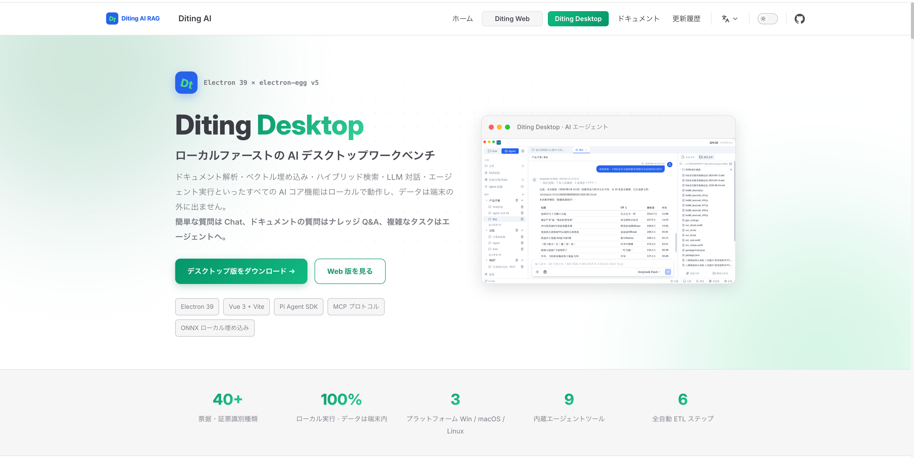

# Diting AI Desktop

<p align="center">
  <a href="https://ditingrag.com/cn/products/desktop">🌐 公式サイト</a> ·
  <a href="#ダウンロード">📥 ダウンロード</a> ·
  <a href="#クイックスタート">🚀 クイックスタート</a> ·
  <a href="./README.md">中文</a> ·
  <a href="./README.en.md">English</a> ·
  <a href="./README.ko.md">한국어</a>
</p>

> 製品の詳細紹介は公式サイトをご覧ください：**[https://ditingrag.com/cn/products/desktop](https://ditingrag.com/cn/products/desktop)**

---

<div align="center">

## ⭐ Ditingがお役に立ちましたら、Starをお願いします！友人や同僚にもぜひおすすめしてください ⭐

</div>

---

Diting AI Desktopは、[electron-egg v5](https://github.com/dromara/electron-egg)フレームワークで構築されたエンタープライズ級クロスプラットフォームデスクトップAIアシスタントです。

ローカルファイル管理、RAGナレッジベース検索、Pi Agentスマートエージェント、LLMマルチターン対話、OCR領収書認識などのAIコア機能を統合し、Windows / macOS / Linuxの3大プラットフォームに対応しています。

> 本プロジェクトはオープンソースプロジェクト[Proma](https://github.com/ErlichLiu/Proma)にインスピレーションを受けています。AgentモードのUIデザインとインタラクションスタイルはPromaの優れた実践を参考にしています。

## プロジェクト紹介



## 機能スクリーンショット

### Chat チャット

マルチモデルマルチターン対話、ストリーミングSSE出力、コンテキストメモリ、ナレッジベース検索拡張（KB_SEARCHモード）。


### Agent スマートエージェント

Pi Agent SDKベースのスマートエージェント。ワークスペース分離、権限モード、ストリーミング思考出力、ツール呼び出しループをサポート。


#### Agent スキル - Skills

組み込みSkillsシステム、カスタムスキルテンプレート対応。


#### Agent スキル - MCP

MCP（Model Context Protocol）ツールプロトコル対応、外部MCP ServerでAgent機能を拡張。


#### Agent スキル - 記憶

ワークスペースのAuto Memory、ユーザー設定とコンテキストメモリの永続化。


### ファイル管理

フォルダスキャン、ファイル同期、Office/PDFプレビュー、RAG自動ベクトル化。


### OCR 領収書認識

PaddleOCRベースのローカル領収書認識モジュール。請求書やレシートのOCR読み取り、アーカイブ参照、スマート解析をサポート。


#### 入力・読み取り

画像またはPDFをアップロードすると、領収書フィールド情報を自動認識。


#### アーカイブ・参照

認識後の領収書は自動アーカイブ、フィールド絞り込みと一括参照をサポート。


### Todo タスク管理

組み込みタスク管理モジュール、タスク作成、グループ化、タグ、優先度管理をサポート。


### スケジュール

カレンダービュー、リマインダー機能。


### タスクボード

ビジュアルタスクボード、ドラッグ＆ドロップでステータス管理。


## 主な機能

- **Chat対話**：マルチモデル対話、ストリーミングSSE出力、コンテキストメモリ、ナレッジベース検索拡張（KB_SEARCHモード）
- **Agentモード**：Pi Agent SDKベースのスマートエージェント、ワークスペース分離、Skillsシステム、MCPツールプロトコル、権限モード、ストリーミング思考出力
- **OCR領収書認識**：PaddleOCRベースのローカル領収書認識、請求書/レシート画像アップロード、自動フィールド抽出、アーカイブ参照
- **ファイル管理**：フォルダスキャン、ファイル同期、Office/PDFプレビュー、RAG自動ベクトル化
- **LLMモデル管理**：マルチモデル設定、接続テスト、パラメータ調整、使用量統計
- **ローカル優先**：すべてのAI機能（埋め込み、検索、ストレージ、OCR）はローカルで実行
- **クロスプラットフォーム**：一つのコードベースでWindows / macOS / Linuxに対応

## モード選択

### Chat対話に適している

- 日常的なQ&A、翻訳、文章校正、軽量なコード議論
- アイデアの迅速な検証、探索的な対話
- 異なるモデル出力の比較
- ナレッジベース検索拡張対話（KB_SEARCHモード）

### Agentに適している

- ローカルファイルの編集、作成、整理
- マルチステップタスク、調査レポート、コード作成
- Skills、MCP、Shellなどの外部ツールの使用
- 権限確認と計画モードが必要な作業
- Agentが自律的にナレッジベース検索を判断（SearchKnowledgeBaseツール）

要約：**日常会話はChat、行動が必要な場合はAgent。Chatはナレッジベース検索をサポートし、Agentは自律的にナレッジベースツールを呼び出せます。**

## クイックスタート

### 環境要件

- Node.js >= v20
- npm または pnpm
- Git

### ダウンロード

[GitHub Releases](https://github.com/shuaiyinoo/Diting_AI_Desktop/releases)から各プラットフォームのインストーラーをダウンロード。

#### macOS インストール時の注意

アプリはAppleコード署名・公証済みです。通常はそのまま開けます。Gatekeeperのキャッシュにより「Ditingが破損しているため開けません」と表示される場合は、以下の方法で解決できます：

**方法1（推奨）：ターミナルコマンド**

```bash
xattr -cr /Applications/Diting.app
```

**方法2：システム設定**

1.「システム設定」→「プライバシーとセキュリティ」を開く
2. 一番下までスクロールし、ブロックされたDitingアプリを見つける
3.「それでも開く」をクリック

### ソースからビルド

```bash
git clone https://github.com/shuaiyinoo/Diting_AI_Desktop.git
cd Diting_AI_Desktop

npm install
cd frontend && npm install && cd ..

npm run re-sqlite

npm run dev

npm run build
npm run start
```

### 初回設定

1. アプリを開き、**設定 > モデル設定**で少なくとも1つのLLMプロバイダーを追加
2. **ファイル管理**でフォルダをナレッジベースソースとして認可
3. ファイルが自動ベクトル化されたら、**Chat**でKB_SEARCHモードを使用して質問
4. **Agent**ページでワークスペースを作成し、スマートエージェントを使用開始

## 技術スタック

| レイヤー | 技術 | バージョン |
|---------|------|-----------|
| デスクトップフレームワーク | Electron + electron-egg v5 | 39.x |
| フロントエンド | Vue 3 + Vite | 3.5 + 7.x |
| UIコンポーネント | shadcn-vue (reka-ui) | 2.10+ |
| 状態管理 | Pinia | 2.3.1 |
| リッチテキスト | TipTap | 3.29.2 |
| Markdown | md-editor-v3 + markstream-vue | 6.5.5 |
| コードハイライト | Shiki | 3.23.0 |
| チャート | Mermaid | 11.16.1 |
| 数式 | KaTeX | 0.18.1 |
| データベース | better-sqlite3 + zvec | 12.5.0 |
| Agent Runtime | @earendil-works/pi-coding-agent | 0.82.1 |
| AI対話 | @earendil-works/pi-ai | 0.82.1 |
| OCR | ppu-paddle-ocr | 6.4.0 |
| ドキュメント解析 | pdf-parse + mammoth | — |
| ベクトル埋め込み | qwen-embedder + hf-embedder | — |
| MCP | @modelcontextprotocol/sdk | 1.30.0 |
| ビルドツール | esbuild + electron-builder | — |

## ライセンス

[Apache License 2.0](./LICENSE)

Copyright 2026 Diting AI

## リンク

- [公式サイト](https://ditingrag.com/cn/products/desktop)
- [リリースノート](./release-notes/)
