# Diting AI Desktop

<p align="center">
  <a href="https://ditingrag.com/cn/products/desktop">🌐 공식 웹사이트</a> ·
  <a href="#다운로드">📥 다운로드</a> ·
  <a href="#빠른-시작">🚀 빠른 시작</a> ·
  <a href="./README.md">中文</a> ·
  <a href="./README.en.md">English</a> ·
  <a href="./README.ja.md">日本語</a>
</p>

> 제품에 대한 자세한 소개는 공식 웹사이트를 방문해 주세요: **[https://ditingrag.com/cn/products/desktop](https://ditingrag.com/cn/products/desktop)**

---

<div align="center">

## ⭐ Diting이 도움이 되셨다면 Star를 부탁드립니다! 친구나 동료에게도 추천해 주세요 — 이것이 우리의 가장 큰 원동력입니다 ⭐

</div>

---

Diting AI Desktop은 [electron-egg v5](https://github.com/dromara/electron-egg) 프레임워크로 구축된 엔터프라이즈급 크로스 플랫폼 데스크톱 AI 어시스턴트입니다.

로컬 파일 관리, RAG 지식 베이스 검색, Pi Agent 스마트 에이전트, LLM 멀티턴 대화, OCR 영수증 인식 등의 AI 핵심 기능을 통합하여 Windows / macOS / Linux 세 가지 플랫폼을 지원합니다.

> 이 프로젝트는 오픈소스 프로젝트 [Proma](https://github.com/ErlichLiu/Proma)에서 영감을 받았습니다. Agent 모드의 UI 디자인과 인터랙션 스타일은 Proma의 우수한 실천을 참고했습니다.

## 프로젝트 소개

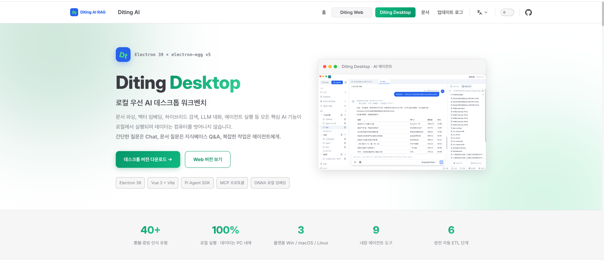

## 기능 스크린샷

### Chat 채팅

멀티 모델 멀티턴 대화, 스트리밍 SSE 출력, 컨텍스트 메모리, 지식 베이스 검색 증강(KB_SEARCH 모드).

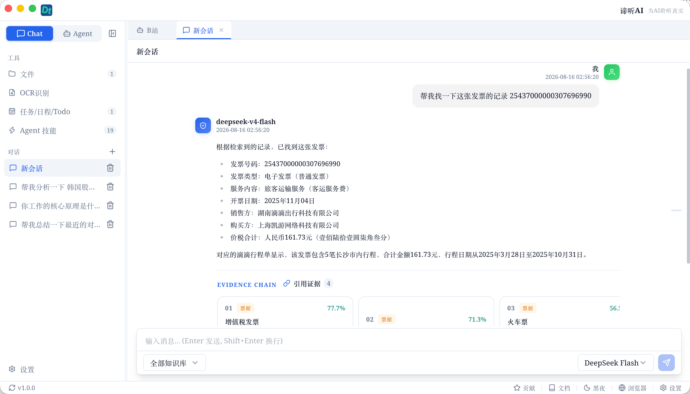

### Agent 스마트 에이전트

Pi Agent SDK 기반 스마트 에이전트. 워크스페이스 분리, 권한 모드, 스트리밍 사고 출력, 도구 호출 루프 지원.

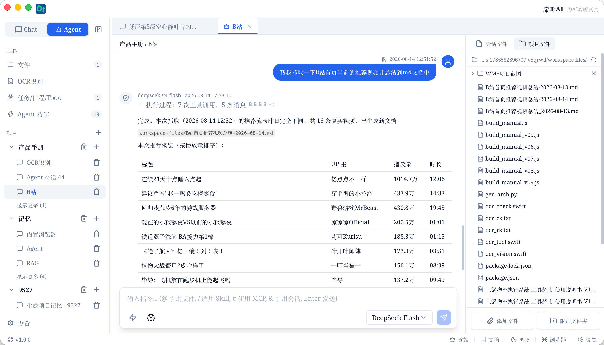

#### Agent 스킬 - Skills

내장 Skills 시스템, 커스텀 스킬 템플릿 지원.

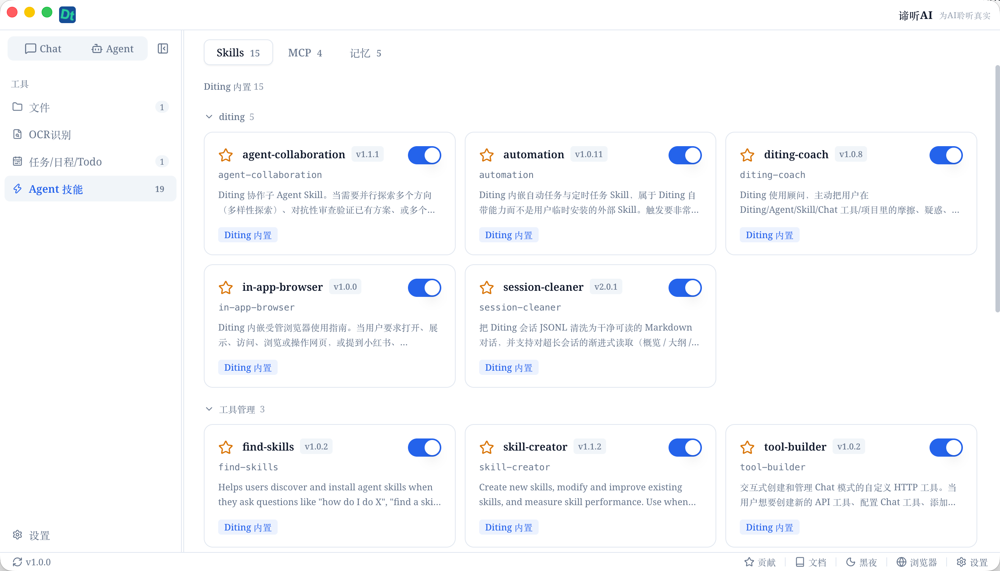

#### Agent 스킬 - MCP

MCP(Model Context Protocol) 도구 프로토콜 지원, 외부 MCP Server로 Agent 기능 확장.

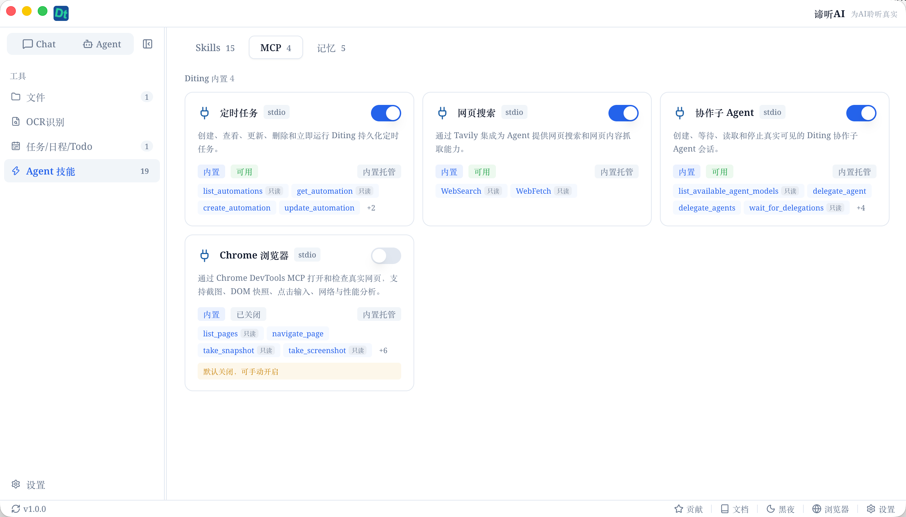

#### Agent 스킬 - 메모리

워크스페이스 Auto Memory, 사용자 설정 및 컨텍스트 메모리 영속화.

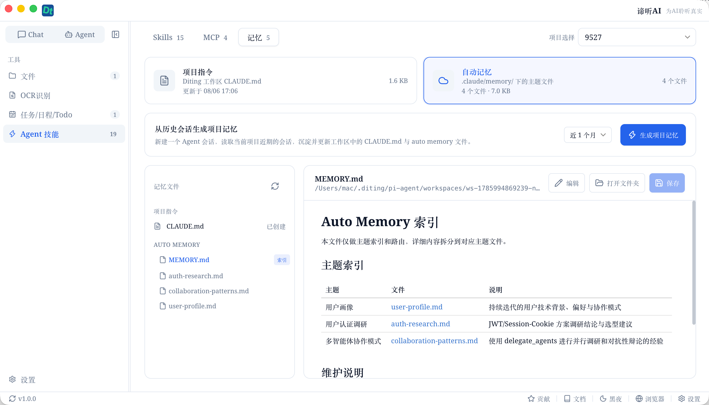

### 파일 관리

폴더 스캔, 파일 동기화, Office/PDF 미리보기, RAG 자동 벡터화.

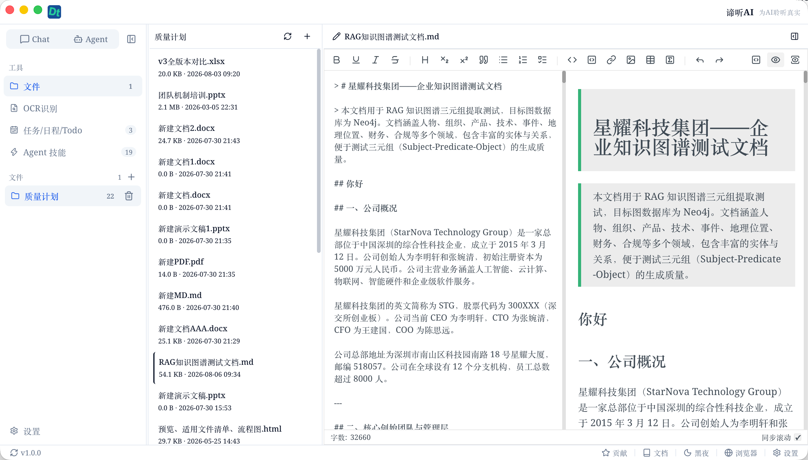

### OCR 영수증 인식

PaddleOCR 기반 로컬 영수증 인식 모듈. 청구서/영수증 이미지 업로드, 자동 필드 추출, 보관 및 조회 지원.

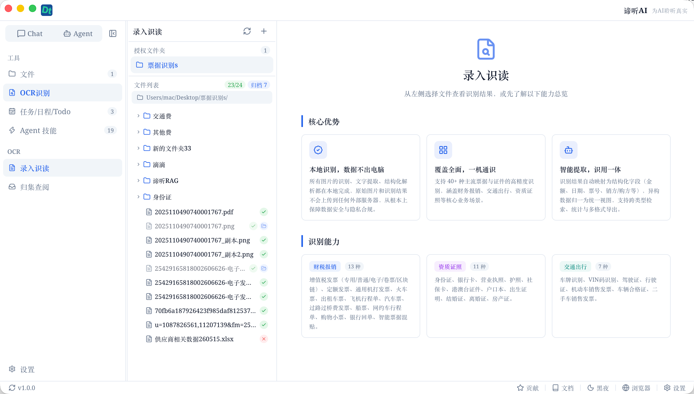

#### 입력 및 인식

이미지 또는 PDF를 업로드하면 영수증 필드 정보를 자동 인식.

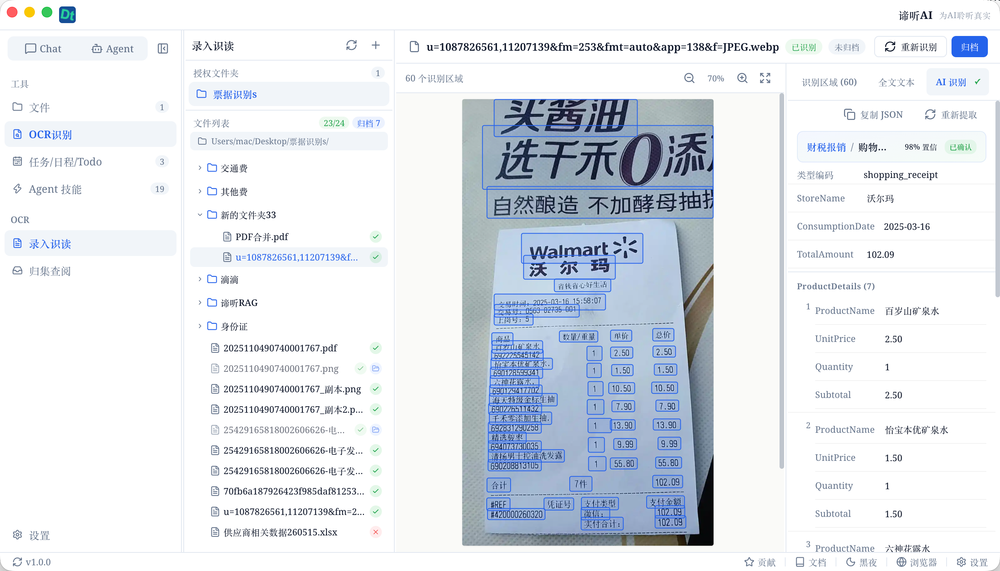

#### 보관 및 조회

인식된 영수증은 자동 보관되며, 필드 필터링 및 일괄 조회를 지원.

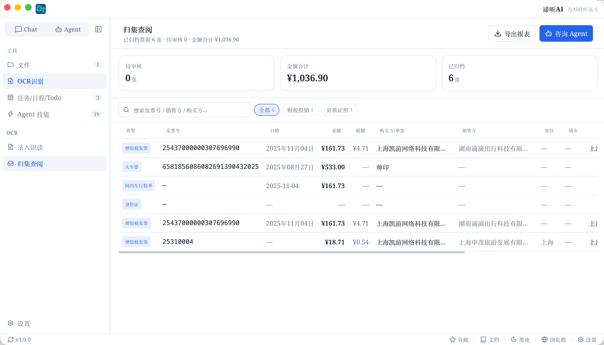

### Todo 작업 관리

내장 작업 관리 모듈, 작업 생성, 그룹화, 태그, 우선순위 관리 지원.

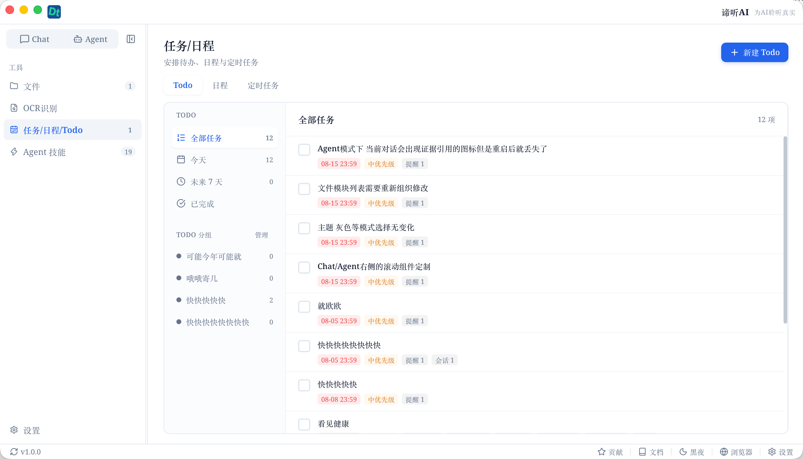

### 일정

캘린더 뷰, 알림 기능.


### 작업 보드

시각적 작업 보드, 드래그 앤 드롭으로 상태 관리.

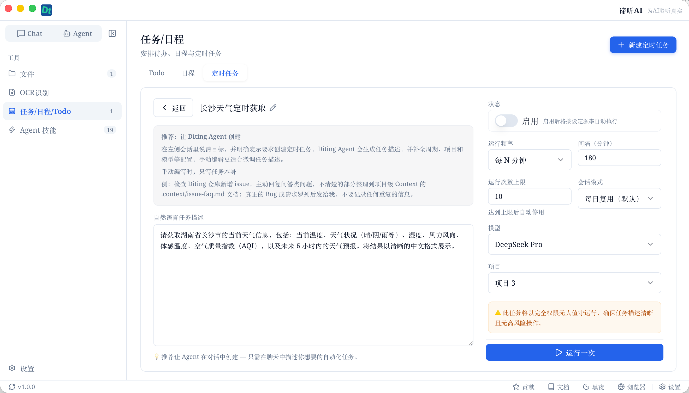

## 주요 기능

- **Chat 대화**: 멀티 모델 대화, 스트리밍 SSE 출력, 컨텍스트 메모리, 지식 베이스 검색 증강(KB_SEARCH 모드)
- **Agent 모드**: Pi Agent SDK 기반 스마트 에이전트, 워크스페이스 분리, Skills 시스템, MCP 도구 프로토콜, 권한 모드, 스트리밍 사고 출력
- **OCR 영수증 인식**: PaddleOCR 기반 로컬 영수증 인식, 청구서/영수증 이미지 업로드, 자동 필드 추출, 보관 조회
- **파일 관리**: 폴더 스캔, 파일 동기화, Office/PDF 미리보기, RAG 자동 벡터화
- **LLM 모델 관리**: 멀티 모델 설정, 연결 테스트, 파라미터 조정, 사용량 통계
- **로컬 우선**: 모든 AI 기능(임베딩, 검색, 저장, OCR)이 로컬에서 실행
- **크로스 플랫폼**: 하나의 코드베이스로 Windows / macOS / Linux 지원

## 모드 선택

### Chat 대화에 적합

- 일상적인 Q&A, 번역, 윤문, 가벼운 코드 논의
- 아이디어 빠른 검증, 탐색적 대화
- 다양한 모델 출력 비교
- 지식 베이스 검색 증강 대화(KB_SEARCH 모드)

### Agent에 적합

- 로컬 파일 수정, 생성, 정리
- 멀티 스텝 작업, 조사 보고서, 코드 작성
- Skills, MCP, Shell 등 외부 도구 사용
- 권한 확인 및 계획 모드가 필요한 작업
- Agent가 자율적으로 지식 베이스 검색 결정(SearchKnowledgeBase 도구)

요약: **일상 대화는 Chat, 행동이 필요할 때는 Agent. Chat은 지식 베이스 검색을 지원하고, Agent는 자율적으로 지식 베이스 도구를 호출할 수 있습니다.**

## 빠른 시작

### 환경 요구사항

- Node.js >= v20
- npm 또는 pnpm
- Git

### 다운로드

[GitHub Releases](https://github.com/shuaiyinoo/Diting_AI_Desktop/releases)에서 각 플랫폼의 설치 프로그램을 다운로드하세요.

#### macOS 설치 시 주의사항

앱이 Apple 코드 서명 및 공증을 받지 않았으므로, macOS에서 "Diting이 손상되어 열 수 없습니다"라는 메시지가 표시될 수 있습니다. macOS Gatekeeper 기능으로 인한 것이며, 다음 방법으로 해결할 수 있습니다:

**방법 1(권장): 터미널 명령**

```bash
xattr -cr /Applications/Diting.app
```

**방법 2: 시스템 설정**

1. "시스템 설정" → "개인정보 및 보안" 열기
2. 맨 아래로 스크롤하여 차단된 Diting 앱 찾기
3. "그래도 열기" 클릭

### 소스에서 빌드

```bash
git clone https://github.com/shuaiyinoo/Diting_AI_Desktop.git
cd Diting_AI_Desktop

npm install
cd frontend && npm install && cd ..

npm run re-sqlite

npm run dev

npm run build
npm run start
```

### 최초 설정

1. 앱을 열고, **설정 > 모델 설정**에서 최소 하나의 LLM 프로바이더 추가
2. **파일 관리**에서 폴더를 지식 베이스 소스로 승인
3. 파일이 자동 벡터화되면, **Chat**에서 KB_SEARCH 모드로 질문
4. **Agent** 페이지에서 워크스페이스를 생성하고 스마트 에이전트 사용 시작

## 기술 스택

| 레이어 | 기술 | 버전 |
|--------|------|------|
| 데스크톱 프레임워크 | Electron + electron-egg v5 | 39.x |
| 프론트엔드 | Vue 3 + Vite | 3.5 + 7.x |
| UI 컴포넌트 | shadcn-vue (reka-ui) | 2.10+ |
| 상태 관리 | Pinia | 2.3.1 |
| 리치 텍스트 | TipTap | 3.29.2 |
| Markdown | md-editor-v3 + markstream-vue | 6.5.5 |
| 코드 하이라이트 | Shiki | 3.23.0 |
| 차트 | Mermaid | 11.16.1 |
| 수식 | KaTeX | 0.18.1 |
| 데이터베이스 | better-sqlite3 + zvec | 12.5.0 |
| Agent Runtime | @earendil-works/pi-coding-agent | 0.82.1 |
| AI 대화 | @earendil-works/pi-ai | 0.82.1 |
| OCR | ppu-paddle-ocr | 6.4.0 |
| 문서 파싱 | pdf-parse + mammoth | — |
| 벡터 임베딩 | qwen-embedder + hf-embedder | — |
| MCP | @modelcontextprotocol/sdk | 1.30.0 |
| 빌드 도구 | esbuild + electron-builder | — |

## 라이선스

[Apache License 2.0](./LICENSE)

Copyright 2026 Diting AI

## 링크

- [공식 웹사이트](https://ditingrag.com/cn/products/desktop)
- [릴리스 노트](./release-notes/)
