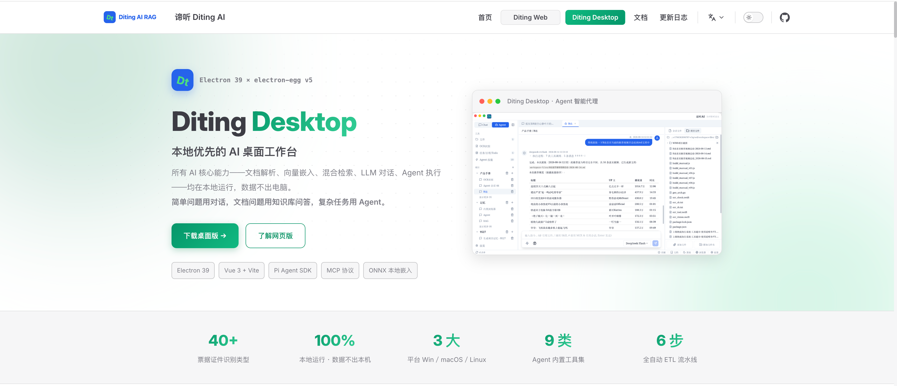

# Diting AI Desktop

<p align="center">
  <a href="https://ditingrag.com/cn/products/desktop">🌐 官网</a> ·
  <a href="#下载安装">📥 下载</a> ·
  <a href="#快速开始">🚀 快速开始</a> ·
  <a href="./README.en.md">English</a> ·
  <a href="./README.ja.md">日本語</a> ·
  <a href="./README.ko.md">한국어</a>
</p>

> 详细的产品介绍请大家移步官网：**[https://ditingrag.com/cn/products/desktop](https://ditingrag.com/cn/products/desktop)**

---

<div align="center">

## ⭐ 如果 Diting 对你有帮助，请给个 Star！也欢迎向同学朋友推荐，这是对我们持续开发的最大动力 ⭐

</div>

---

Diting AI Desktop（谛听 AI 桌面客户端）是一款基于 [electron-egg v5](https://github.com/dromara/electron-egg) 框架构建的企业级跨平台桌面 AI 助手应用。

它融合了本地文件管理、RAG 知识库检索、Pi Agent 智能代理、LLM 多轮对话、OCR 票据识别等 AI 核心能力，面向 Windows / macOS / Linux 三大平台，旨在为用户提供高效、安全、本地优先的桌面 AI 工作台。

> 本项目受 [Proma](https://github.com/ErlichLiu/Proma) 开源项目启发，Agent 模式的 UI 设计与交互风格参考了 Proma 的优秀实践，特此感谢。

## 项目介绍



## 功能截图

### Chat 对话

支持多模型多轮对话、流式 SSE 输出、上下文记忆、知识库检索增强（KB_SEARCH 模式），在对话中随时引用本地文档证据。


### Agent 智能代理

基于 Pi Agent SDK 的智能代理，支持工作区隔离、权限模式、流式思考输出、工具调用循环。


#### Agent 技能 - Skills

内置 Skills 技能系统，支持自定义技能模板，Agent 可按需加载并执行。


#### Agent 技能 - MCP

支持 MCP（Model Context Protocol）工具协议，可接入外部 MCP Server 扩展 Agent 能力。


#### Agent 技能 - 记忆

Agent 工作区支持 Auto Memory，可持久化用户偏好和上下文记忆。


### 文件管理

授权文件夹扫描、文件同步、Office/PDF 在线预览、RAG 自动向量化。


### OCR 票据识别

基于 PaddleOCR 的本地票据识别模块，支持发票、收据等票据的 OCR 识读、归集查阅和智能解析。


#### 录入识读

上传图片或 PDF，自动识别票据字段信息。


#### 归集查阅

识别后的票据自动归档，支持按字段筛选和批量查阅。


### Todo 任务管理

内置任务管理模块，支持任务创建、分组、标签、优先级管理。


### 日程规划

日程视图，支持日历展示和提醒。


### 任务看板

可视化任务看板，拖拽管理任务状态。


## 现在能做什么

- **Chat 对话**：多模型对话、流式 SSE 输出、上下文记忆、知识库检索增强（KB_SEARCH 模式）
- **Agent 模式**：基于 Pi Agent SDK 的智能代理，支持工作区隔离、Skills 技能系统、MCP 工具协议、权限模式、流式思考输出
- **OCR 票据识别**：基于 PaddleOCR 的本地票据识别，支持发票/收据图片上传、自动字段提取、归集查阅
- **文件管理**：授权文件夹扫描、文件同步、Office/PDF 在线预览、RAG 自动向量化
- **LLM 模型管理**：多模型配置、连接测试、参数调优、用量统计与费用估算
- **本地优先**：所有 AI 能力（嵌入、检索、存储、OCR）本地执行，数据不上传云端
- **跨平台**：一套代码打包 Windows / macOS / Linux

## 模式选择

### Chat 对话适合

- 日常问答、翻译、润色、轻量代码讨论
- 快速验证想法、探索性对话
- 对比不同模型输出
- 需要知识库检索增强的对话（KB_SEARCH 模式）

### Agent 适合

- 修改、创建、整理本地文件
- 多步骤任务、调研报告、代码编写
- 使用 Skills、MCP、Shell 等外部工具
- 需要权限确认和计划模式的工作
- Agent 可自主决定何时检索知识库（通过 SearchKnowledgeBase 工具）

简单说：**日常交流用 Chat，需要行动用 Agent。Chat 支持知识库检索增强，Agent 能自主调用知识库工具。**

### Chat 与 Agent 的协调关系

```
                    ┌─────────────────────────────────────┐
                    │          混合检索引擎                │
                    │  hybridRetrievalService             │
                    │  ┌───────────┐  ┌────────────────┐ │
                    │  │ 向量检索   │  │ 关键词检索      │ │
                    │  │ (zvec)    │  │ (MiniSearch)   │ │
                    │  └─────┬─────┘  └───────┬────────┘ │
                    │        └──── RRF 融合 ──┘          │
                    │              ↓                      │
                    │     证据文档 + 证据等级 + 引用       │
                    └──────────┬───────────┬────────────┘
                               │           │
                ┌──────────────┘           └──────────────┐
                │                                         │
          ┌─────↓─────┐                            ┌───────↓──────┐
          │  Chat 对话  │                            │    Agent     │
          │(assistant) │                            │  (piAgent)   │
          │            │                            │              │
          │ CHAT 模式:  │                            │ SearchKnowledgeBase
          │  纯对话     │                            │ (Agent 自主调用)
          │ KB_SEARCH:  │                            │ → 检索 → 注入上下文
          │  检索+对话  │                            │ → 继续推理 + 工具调用
          └────────────┘                            └──────────────┘
```

| 模式 | 触发方式 | 检索范围 | 使用场景 |
|------|---------|---------|---------|
| **Chat KB_SEARCH** | 用户发消息时选择知识库模式 | `retrieve(folderId, message, 5)` 指定文件夹 | `/chat` 页面，对话中检索 |
| **Agent** | LLM **自主决定**调用 `SearchKnowledgeBase` | `retrieve(folderId, query, topK)` 或 `retrieveAll(query, topK)` 全库 | `/agent` 页面，Agent 推理中检索 |

## 快速开始

### 环境要求

- Node.js >= v20
- npm 或 pnpm
- Git

### 下载安装

从 [GitHub Releases](https://github.com/shuaiyinoo/Diting_AI_Desktop/releases) 下载对应平台安装包。

#### macOS 安装注意事项

由于应用未进行 Apple 代码签名和公证，macOS 安装后打开可能提示「"Diting"已损坏，无法打开」。这是 macOS Gatekeeper 安全机制导致，可通过以下方式解决：

**方法一（推荐）：终端命令去除隔离标记**

```bash
xattr -cr /Applications/Diting.app
```

**方法二：系统设置放行**

1. 打开「系统设置」→「隐私与安全性」
2. 滚动到底部，找到被拦截的 Diting 应用提示
3. 点击「仍要打开」

> 如果使用 Homebrew Cask 安装，可执行 `xattr -cr -- $(brew --prefix)/Caskroom/Diting`

### 从源码构建

```bash
# 克隆仓库
git clone https://github.com/shuaiyinoo/Diting_AI_Desktop.git
cd Diting_AI_Desktop

# 安装依赖
npm install

# 安装前端依赖
cd frontend && npm install && cd ..

# 为 Electron 重建 better-sqlite3 原生模块
npm run re-sqlite

# 开发模式（frontend + electron 同时启动）
npm run dev

# 构建并运行
npm run build
npm run start
```

### 首次配置

1. 打开应用，进入 **设置 > 模型配置**，添加至少一个 LLM 供应商（Base URL + API Key + 模型名称）
2. 进入 **文件管理**，授权一个文件夹作为知识库源
3. 文件会自动向量化，完成后可在 **Chat** 中使用 KB_SEARCH 模式提问
4. 在 **Agent** 页面创建工作区，开始使用智能代理

## 技术栈

| 层级 | 技术 | 版本 |
|------|------|------|
| 桌面框架 | Electron + electron-egg v5 | 39.x |
| 前端框架 | Vue 3 + Vite | 3.5 + 7.x |
| UI 组件 | shadcn-vue (reka-ui) | 2.10+ |
| 状态管理 | Pinia | 2.3.1 |
| 富文本编辑 | TipTap | 3.29.2 |
| Markdown 渲染 | md-editor-v3 + markstream-vue | 6.5.5 |
| 代码高亮 | Shiki | 3.23.0 |
| 图表 | Mermaid | 11.16.1 |
| 数学公式 | KaTeX | 0.18.1 |
| 数据库 | better-sqlite3 + zvec | 12.5.0 |
| Agent Runtime | @earendil-works/pi-coding-agent | 0.82.1 |
| AI 对话 | @earendil-works/pi-ai | 0.82.1 |
| OCR 识别 | ppu-paddle-ocr | 6.4.0 |
| 文档解析 | pdf-parse + mammoth | — |
| 向量嵌入 | qwen-embedder + hf-embedder | — |
| MCP | @modelcontextprotocol/sdk | 1.30.0 |
| 构建工具 | esbuild + electron-builder | — |

## 架构概览

```text
Frontend (Vue 3 + shadcn-vue + Pinia)
  ↕ IPC / HTTP / Socket.IO
Electron Main Process
  ├── Controller（业务控制层）
  ├── Service（业务服务层）
  ├── Components（AI 核心组件）
  │     ├── rag/      (RAG 检索增强)
  │     ├── pi/       (Agent 智能体)
  │     ├── file/     (文件同步管理)
  │     └── invoice/  (OCR 票据识别)
  └── Database (SQLite + zvec 向量存储)
electron-egg v5 (ee-core + ee-bin)
Electron 39 + Node.js v20
```

核心通信路径：
- **IPC**：主进程 ↔ 渲染进程（`ipcMain.handle` + `ipcRenderer.invoke`）
- **HTTP**：Koa RESTful API（端口 7071），供外部服务调用
- **Socket.IO**：WebSocket（端口 7070），实时数据推送
- **SSE**：流式输出统一通过 Server-Sent Events 推送

更完整的工程约定见 [AGENTS.md](./AGENTS.md)。

## 本地数据

```text
~/.diting/
├── channels.json           # LLM 模型配置
├── conversations/          # 对话消息存储 (JSONL)
├── agent-sessions/         # Agent 会话存储 (JSONL)
├── agent-workspaces/       # Agent 工作区目录
│   └── {workspace-slug}/
│       ├── mcp.json        # MCP Server 配置
│       └── skills/         # Skills 配置
├── attachments/            # 附件文件
└── data/                   # SQLite 数据库
    ├── file.db             # 文件索引
    ├── llm.db              # 模型配置
    ├── assistant.db        # 助手会话
    ├── invoice.db          # OCR 票据数据
    └── rag.db              # 向量索引
```

## 开发与构建

### 开发命令

```bash
npm run dev               # 完整开发（frontend + electron）
npm run dev-frontend      # 仅前端开发（Vite dev server :8080）
npm run dev-electron      # 仅 Electron 开发
npm run debug-dev         # 全量调试日志开发模式
```

### 构建命令

```bash
npm run build             # 构建 frontend + electron + 加密
npm run build-frontend    # Vite 构建前端
npm run build-electron    # esbuild 打包 Electron
```

### 平台打包

```bash
npm run build-m           # macOS ARM64
npm run build-m-x86       # macOS x64
npm run build-w           # Windows 64-bit
npm run build-l           # Linux
```

## 贡献

欢迎修 Bug、补文档、加测试、完善体验。

提交 PR 前建议先确认：

- 使用 `npm run dev` 能正常启动
- 状态管理使用 Pinia
- 尽量保持本地优先，优先使用 SQLite 和配置文件
- UI 组件使用 shadcn-vue (reka-ui)
- 注释和日志采用中文，保留必要的专业术语

## 致谢

本项目的诞生离不开以下优秀的开源项目和框架：

### 核心框架

- **[electron-egg v5](https://github.com/dromara/electron-egg)** — 企业级桌面应用开发框架，提供了生命周期管理、多通道通信、构建打包、加密等基础设施
- **[Proma](https://github.com/ErlichLiu/Proma)** — 开源 AI 桌面应用，本项目 Agent 模式的 UI 设计、交互风格、权限模式切换和思考深度组件均受其启发

### AI 能力

- **[@earendil-works/pi-coding-agent](https://github.com/earendil-works/pi-coding-agent)** — Pi Agent SDK，Agent 智能代理核心运行时
- **[@earendil-works/pi-ai](https://github.com/earendil-works/pi-ai)** — Pi AI 对话引擎
- **[@modelcontextprotocol/sdk](https://github.com/modelcontextprotocol/modelcontextprotocol)** — Model Context Protocol，标准化外部工具接入

### 前端生态

- **[Vue 3](https://vuejs.org/)** — 渐进式 JavaScript 框架
- **[shadcn-vue](https://www.shadcn-vue.com/)** — 基于 reka-ui 的高质量 UI 组件库
- **[Vite](https://vitejs.dev/)** — 下一代前端构建工具
- **[Pinia](https://pinia.vuejs.org/)** — Vue 官方推荐的状态管理库
- **[TipTap](https://tiptap.dev/)** — 无头富文本编辑器框架
- **[Shiki](https://shiki.style/)** — 基于 TextMate 语法的代码高亮
- **[Mermaid](https://mermaid.js.org/)** — JavaScript 图表库
- **[KaTeX](https://katex.org/)** — 快速数学公式渲染

### 数据与检索

- **[better-sqlite3](https://github.com/WiseLibs/better-sqlite3)** — 同步 SQLite3 绑定
- **[MiniSearch](https://github.com/lucaong/minisearch)** — 轻量全文搜索引擎
- **[pdf-parse](https://github.com/gkatsis/pdf-parse)** — PDF 文本提取
- **[mammoth](https://github.com/mwilliamson/mammoth.js)** — DOCX 文档解析

### OCR 识别

- **[PaddleOCR](https://github.com/PaddlePaddle/PaddleOCR)** — 百度飞桨 OCR 引擎，票据识别核心

### 工具链

- **[Electron](https://www.electronjs.org/)** — 跨平台桌面应用框架
- **[electron-builder](https://github.com/electron-userland/electron-builder)** — Electron 打包工具
- **[esbuild](https://esbuild.github.io/)** — 极速 JavaScript 打包器
- **[TypeScript](https://www.typescriptlang.org/)** — JavaScript 的类型超集

## 许可证

本项目基于 [Apache License 2.0](./LICENSE) 开源协议发布。

Copyright 2026 Diting AI

您可以自由使用、修改和分发本软件，但需遵守 Apache 2.0 协议的相关条款。

## 链接

- [官网](https://ditingrag.com/cn/products/desktop)
- [用户教程](./tutorial/tutorial.md)
- [AI 编码指南](./AGENTS.md)
- [发布说明](./release-notes/)
