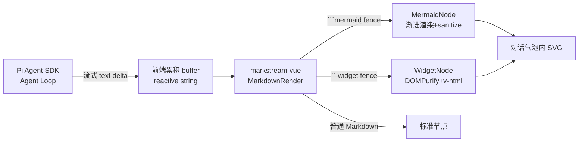

# Diting Agent 内联可视化能力实现指南

> 目标：让基于 **Pi Agent SDK** 的 Diting Agent（Electron + Vue3 桌面端），在对话流里像 WorkBuddy 一样**内联渲染图表**（架构图 / 流程图 / 时序图 / 对比表 / 自由 SVG 原型）。
> 前提：前端已使用 **markstream-vue** 做流式 Markdown 渲染；Agent 运行时基于 Pi Agent SDK（Proma 同款 `@earendil-works/pi-*`）。
> 核心结论：**不引入额外代理层**，全部复用 markstream-vue 的原生能力 + 两套 Markdown fence 约定。

---

## 0. 能力分层（先决定用哪种图）

| 图类型 | 推荐方案 | 说明 |
|---|---|---|
| 架构图 / 流程图 / 时序图 / 类图 / 状态图 | **Mermaid（路线 A，首选）** | markstream-vue 原生支持，渐进渲染、自带 sanitize、主题跟随，零自定义渲染代码 |
| 自由 SVG / HTML 原型 / 美术图（对标 WorkBuddy 手写 SVG） | **自定义 `widget` fence（路线 B）** | 用 `setCustomComponents` 注册一个 Vue 组件，把模型产出的原始 SVG 净化后内联渲染 |

> 建议：**标准图一律走 Mermaid**；只有 Mermaid 表达不了的定制图形才走 `widget`。两者都作为 Markdown fence 内嵌在 Assistant 文本流中，由 markstream-vue 在同一气泡里渐进渲染，体验与 WorkBuddy 一致。

---

## 1. 端到端数据流（总览）



要点：**图是 Markdown 文本的一部分**，不是独立工具返回值。这样 markstream-vue 能把它和前后文字一起流式、渐进地渲染，无需 IPC 把图形"塞"进单独区域。

---

## 2. 实施步骤（编码 AI 照此实现）

### 步骤 1：安装依赖并启用 Mermaid

```bash
pnpm add markstream-vue mermaid
# 或 npm i markstream-vue mermaid
```

在应用入口（`main.ts` 或插件里）启用 Mermaid：

```ts
// main.ts
import { createApp } from 'vue'
import MarkdownRender, { enableMermaid } from 'markstream-vue'
import 'markstream-vue/index.css'
import App from './App.vue'

enableMermaid() // 必须在渲染前调用一次，启用内置 Mermaid 渐进渲染
createApp(App).component('MarkdownRender', MarkdownRender).mount('#app')
```

在聊天渲染组件里打开开关：

```vue
<!-- ChatBubble.vue -->
<template>
  <MarkdownRender
    :content="streamBuffer"
    :enable-mermaid="true"
    :mermaid-options="{ startOnLoad: false, securityLevel: 'strict' }"
    :is-dark="isDark"
  />
</template>
```

> Mermaid 默认即 strict 模式且渲染后 SVG 会被 markstream-vue 净化，无需额外处理。

---

### 步骤 2：注册自定义 `widget` 组件（自由 SVG 路线）

新建组件 `WidgetNode.vue`，负责把模型产出的原始 SVG 净化后内联渲染，并带加载态：

```vue
<!-- WidgetNode.vue -->
<script setup lang="ts">
import { computed } from 'vue'
import DOMPurify from 'dompurify'

const props = defineProps<{
  node: { type: 'code_block'; language: string; code: string; raw: string }
  loading?: boolean
  isDark?: boolean
}>()

// 仅当 fence 完整（无 loading）才渲染，避免半成品 SVG 畸形
const safeSvg = computed(() => {
  if (props.loading) return ''
  return DOMPurify.sanitize(props.node.code, { USE_PROFILES: { svg: true, svgFilters: true } })
})
</script>

<template>
  <div class="diting-widget" :class="{ 'is-dark': isDark }">
    <div v-if="loading" class="widget-loading">图表渲染中…</div>
    <div v-else-if="safeSvg" class="widget-body" v-html="safeSvg" />
    <pre v-else class="widget-fallback">{{ node.raw }}</pre>
  </div>
</template>
```

在入口注册（用 **scoped 覆盖**，避免污染其它页面）：

```ts
import { setCustomComponents } from 'markstream-vue'
import WidgetNode from './WidgetNode.vue'

// 'chat' 是自定义 customId，渲染时 MarkdownRender 需带 :custom-id="'chat'"
setCustomComponents('chat', { widget: WidgetNode })
```

> markstream-vue 的代码块路由顺序：**精确语言 key（如 widget）→ 内置专用（mermaid/d2/infographic）→ 通用 code_block**。所以 ```` ```widget ```` 会被精准路由到 `WidgetNode`。

---

### 步骤 3：让 Agent 产出图（Prompt 规则，无需写工具）

**推荐纯 Prompt 法**：在系统提示里规定 Agent 何时、以何种 fence 输出图。这样图直接进 Markdown 流，无需工具 / IPC。

系统提示追加（中文）：

```
## 可视化输出规范
当用户需要"看"而非"读"时，优先用内联图表代替大段文字：
1. 架构图 / 流程图 / 时序图 / 类图 / 状态图 / 对比：使用 Mermaid，输出为 ```mermaid 代码块。
   - 示例：
     ```mermaid
     flowchart LR
       A[客户端] --> B[后端]
     ```
2. 自由 SVG 原型 / 美术图 / Mermaid 无法表达的定制图：输出为 ```widget 代码块，内部为完整 <svg>…</svg> 片段（viewBox 起始 "0 0 680"，所有形状显式 fill，禁止依赖外部 CSS）。
3. 主题：亮色主题下用浅色背景深字，暗色下反之。
4. 不要口头解释"下面是图"，直接给出 fence 即可。
```

> **可选工具法（不推荐默认开启）**：若希望模型"显式请求绘图"而非混在文本，可定义 `render_diagram` 工具，其 `execute` 返回 `{ content:[text], details:{ kind:'diagram', svg } }`，再由 `session.subscribe` 监听 `tool_execution_end` 经 IPC 发到单独组件。但该法绕开 markstream-vue、需自建渲染区，**仅当图必须脱离文本流时才用**。

---

### 步骤 4：把 Pi Agent SDK 的流式文本接入 markstream-vue

把 Assistant 的增量文本累积进一个 `ref`，绑定到 `MarkdownRender` 的 `:content`（或 `:stream`）。

```ts
import { ref, onUnmounted } from 'vue'
import type { PiSession } from '@earendil-works/pi-agent' // 具体包名以你的 SDK 版本为准

const streamBuffer = ref('')
let session: PiSession

function startAgent(userInput: string) {
  streamBuffer.value = ''
  session = createSession() // 见 Pi SDK 文档

  // 订阅流式事件，把文本增量追加到 buffer
  // 注：事件名随 SDK 版本不同，常见为 message_chunk / token / partial_response
  const unsub = session.subscribe((event: any) => {
    if (event.type === 'message_chunk' || event.type === 'token') {
      streamBuffer.value += event.text ?? ''
    }
  })

  session.run(userInput)
  onUnmounted(unsub)
}
```

模板侧：

```vue
<MarkdownRender
  :content="streamBuffer"
  :enable-mermaid="true"
  custom-id="chat"
  :is-dark="isDark"
/>
```

> markstream-vue 会自动处理"未闭合 fence"：Mermaid 在语法就绪前显示占位，SVG widget 通过 `loading` 态延迟渲染，避免畸形。

---

### 步骤 5：主题适配

- 暗色：给 `MarkdownRender` 传 `:is-dark="true"`，或在祖先元素加 `.dark` 类（markstream-vue 暗色变量由此作用）。
- Mermaid 主题：通过 `:mermaid-options` 注入 `theme: 'default' | 'dark'`，与当前主题保持一致。
- 自由 SVG（widget）：要求模型在 SVG 内用显式 `fill`，不要依赖 `currentColor` 之外的外部样式；组件内可依据 `isDark` 加一层 CSS filter 兜底。

---

### 步骤 6：安全（必做）

1. **widget SVG 必须净化**：`DOMPurify.sanitize(svg, { USE_PROFILES: { svg: true } })`，禁止裸 `v-html` 未净化内容（防 XSS）。
2. **Mermaid 保持 strict**：默认即 strict，且渲染后 SVG 已被 markstream-vue 净化，不要为 LLM 输出关闭 strict。
3. **用户生成内容**：若将来渲染用户侧 HTML，给 `MarkdownRender` 加 `html-policy="escape"`。
4. **不要回灌 details**：若用了工具法，details 里的 SVG 只给 UI，绝不重新塞回 LLM prompt（防注入 + 省 token）。

---

### 步骤 7：加载态与错误兜底

- **Mermaid**：markstream-vue 的 `MermaidBlockNode` 自带三阶段（占位 → 异步解析 → 渐显），无需手写。
- **widget**：用 `loading` 标记 fence 是否闭合；闭合后再净化渲染。
- **渲染错误**：监听 `onRenderError`（MermaidBlockNode 支持），把源码以 `<pre>` 回退展示，不要抛默认报错：

```ts
function handleMermaidError(_err: unknown, code: string, container: HTMLElement) {
  const pre = document.createElement('pre')
  pre.className = 'text-sm font-mono whitespace-pre-wrap p-4'
  pre.textContent = code
  container.replaceChildren(pre)
  return true // 阻止默认错误展示
}
```

---

### 步骤 8：持久化与重载（会话恢复）

- **只存原始 Markdown 文本**（包含 ```` ```mermaid ```` / ```` ```widget ```` fence），连同消息一起存入历史。
- 重新打开会话时，把同一段文本直接喂给 `MarkdownRender` 的 `:content` 即可**重新渲染图形，无需再调 LLM**。
- 不要单独存 details/SVG：重渲染由 Markdown 源驱动，保证图文一致。

---

## 3. 编码 AI 验收清单（Checklist）

- [ ] `markstream-vue` + `mermaid` 已安装，`enableMermaid()` 在渲染前调用一次
- [ ] 聊天气泡 `<MarkdownRender :enable-mermaid="true" :is-dark="...">` 已挂载
- [ ] ```` ```mermaid ```` 块能被渐进渲染为 SVG（用文档里的 `flowchart LR` 示例验证）
- [ ] `WidgetNode.vue` 已用 `DOMPurify.sanitize` 净化后 `v-html`，带 loading 态
- [ ] `setCustomComponents('chat', { widget: WidgetNode })` 已注册，且渲染组件带 `custom-id="chat"`
- [ ] ```` ```widget ```` 块内 SVG 能内联显示，主题跟随亮/暗
- [ ] 系统提示已加入"可视化输出规范"（Mermaid / widget 两种 fence 约定）
- [ ] Pi SDK 流式文本增量已累积并绑定到 `:content`，Mermaid/widget 随流渐进出现
- [ ] 暗色切换时图表不糊（Mermaid theme + SVG 显式 fill 验证）
- [ ] 会话重载时仅用存储的 Markdown 文本即可复现图形
- [ ] 安全扫描：未净化 SVG 无法注入（可尝试构造含 `<script>` 的 widget 验证被净化）

---

## 4. 与 WorkBuddy 的差异（便于理解）

| 维度 | WorkBuddy 实际做法 | 本方案（Diting Agent） |
|---|---|---|
| 图的产生 | 模型手写完整 SVG，经 `show_widget` 内联渲染 | 标准图走 Mermaid（模型写文本）；自由图走 `widget`（模型写 SVG，组件净化渲染） |
| 渲染层 | 平台内置 Visualizer（read_me + show_widget） | markstream-vue（你们已在用） |
| 是否代理 | 否 | 否 |
| 主题规范 | 出图前 `read_me` 加载 CSS 变量 | Mermaid 自带主题；widget 由 `isDark` + 模型显式 fill 保证 |
| 安全 | 平台内部净化 | `DOMPurify` + Mermaid strict（需显式实现） |

---

## 5. 风险与坑

1. **XSS**：widget 的 SVG 不净化直接 `v-html` 是高危，必须 `DOMPurify`。
2. **Mermaid 版本**：`mermaid` 需与 markstream-vue 文档建议版本匹配，避免解析异常。
3. **自定义组件作用域**：用 `setCustomComponents('chat', ...)` 而非全局，避免影响文档/其它页面。
4. **未闭合 fence**：流式过程中 fence 可能未闭合，widget 必须等 `loading=false` 再渲染，否则畸形。
5. **事件名差异**：Pi SDK 的流式事件名随版本变化，以你的 SDK 文档为准，模式（累积 delta → 绑 content）不变。
6. **主题漂移**：模型若用 `currentColor` 或依赖外部 CSS，暗色下会糊；规范里要求显式 `fill`。

---

## 6. 推荐落地顺序（P0→P2）

- **P0**：步骤 1 + 步骤 4 + 步骤 3（Mermaid 路线）。半天即可让对话出架构/流程图。
- **P1**：步骤 2 + 步骤 6 + 步骤 5（widget 自由 SVG + 安全 + 主题）。
- **P2**：步骤 7（错误兜底）+ 步骤 8（会话持久化）+ 步骤 3 的工具法（可选）。
